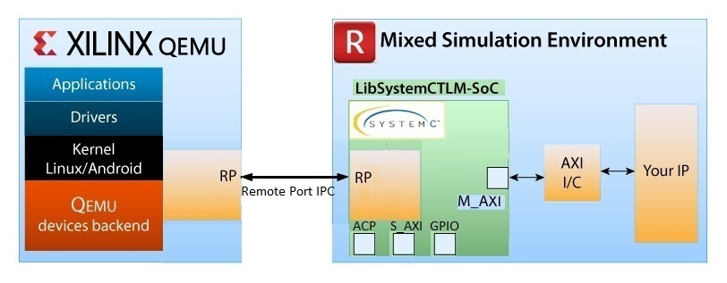
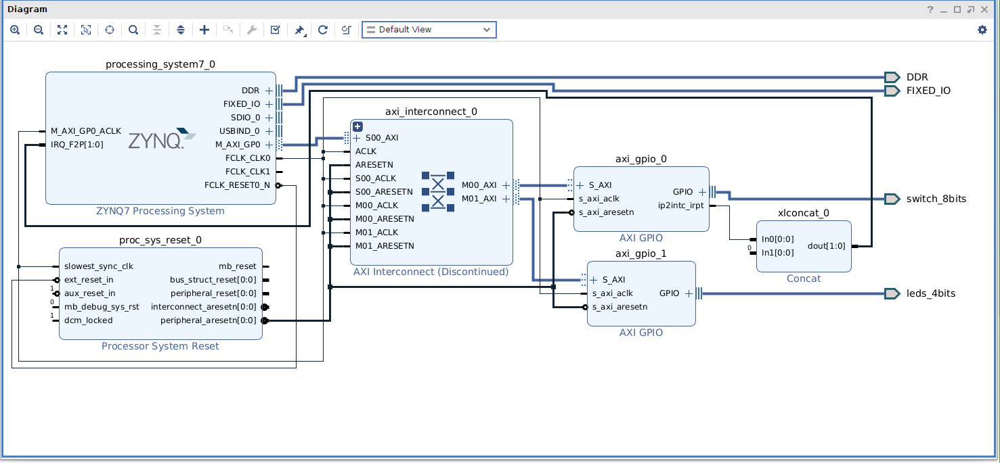
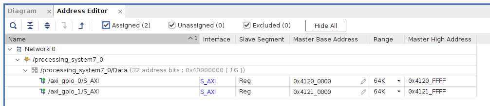
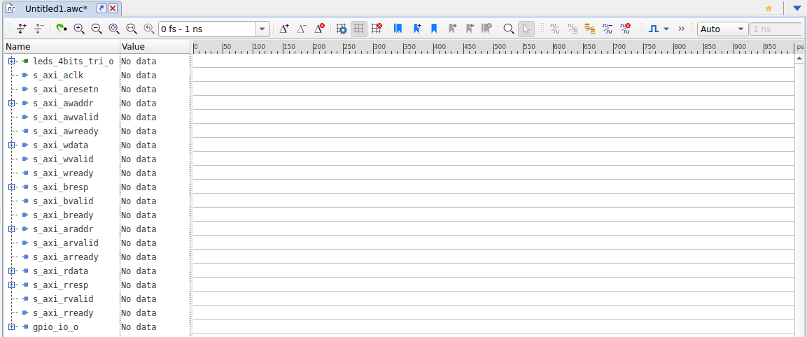
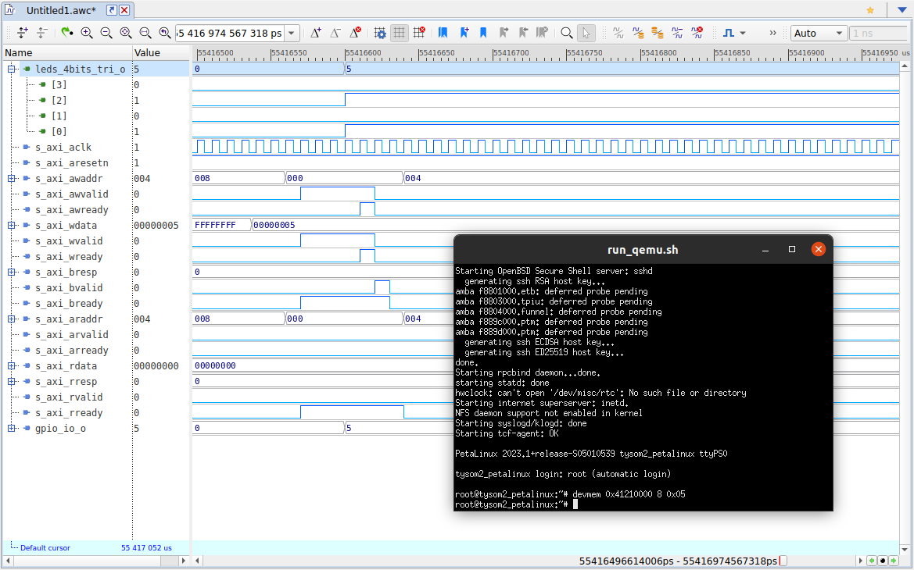
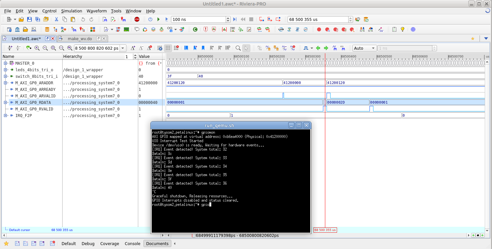

**Resources**

This solution is based on the [blog article](https://blog.reds.ch/?p=1180) and some files created by Rick Wertenbroek. A detailed technical description can be found on the Wiki Xilinx [website](https://xilinx-wiki.atlassian.net/wiki/spaces/A/pages/862421112/Co-simulation).

**Requirements**

* Aldec Riviera-Pro 2024.04
* Xilinx Vivado 2024.2
* Xilinx Petalinux 2024.2

Project was checked on a Ubuntu 22.04 LTS operating system

# Introduction

Today's SoC FPGAs present new verification challenges for system, software and hardware engineers. Common issues related to HW/SW integration continue to increase, and yet they are only typically found in the methodology with the SoC FPGA running. Finding the issues in the methodology of testing is often too late and can cause project delays.
The situation on FPGA chips market is unpredictable. The emulation tools is good way to solve time to market delay and to bring tested and ready to use system out.



Aldec provides a HW/SW co-simulation interface between Riviera-PRO and Xilinx Quick Emulator QEMU. System integration and co-simulation of HDL code with software applications/drivers executing in QEMU is now simplified with full compilation SystemC to library (LibSystemCTLM-SoC). It is executed under Riviera-Pro simulator. The LibSystemCTLM-SoC shares Remote Port to connect Riviera-PRO and QEMU, and converts SystemC TLM transactions to AXI and vice versa providing a fast interface for co-simulation.
Figure \ref{cosim} presents the block diagram of HW/SW co-simulation Environment with Riviera-PRO and QEMU.
This document will focus on executing an example project in co-simulation and describing the available scripts to automate the building process.

# Preparing co-simulation sources

This chapter describes a process of preparing co-simulation environment. The first step requires a Vivado Zynq SoC project from which the simulation model is generated. The obtained simulation model is then connected to the TLM sockets and the Zynq processing system is emulated on the QEMU platform. Communication between the SW and HW layers takes place via the Remote Port.
To facilitate the co-simulation process, Aldec provides a repository with scripts to building and running project files. The repository is based on the example Vivado project described in the next chapter. Nothing prevents a User from replacing this project with another and taking full advantage of the possibility to co-simulate own solution.
To download the repository, run the command:

```sh
git clone https://github.com/aldec/TySOM-QEMU.git
```

## Preparation of HW project

The easiest way to start creating a Vivado project that will be co-simulated is to use the Aldec Board files. Using Vivado board definitions allows to create systems faster. After selecting a specific board, the project is configured with the predefined interface for that board and the Vivado design tools provide designer assistance to IP customization and creating IP integrator designs. More details how to build a Vivado design using board definition can be found [here](https://github.com/aldec/TySOM/blob/master/Vivado-board_files/How_to_build_an_FPGA_design_for_Aldec_TySOM_boards_using_board_definition_in_Xilinx_Vivado.pdf).

The example Vivado projects demonstrating possibilities of QEMU SystemC co-simulation were prepared as follows:

:::Note
First step is to download Aldec TySOM *Vivado-board-files* and add them to Vivado, however example is already prepared with two template board design.
:::

* Select the board (project) `TySOM-2-7Z100` or `TySOM-3-ZU7`:
```sh
cd TySOM-2-7Z100
```

  or

```sh
cd TySOM-3-ZU7
```

* Prepare co-simulation files
   * Modify config.sh script. Set the proper paths to Riviera-Pro simulator and Xilinx Petalinux tool.
   * Run scripts

        ```sh
        ./prepare_hardware.sh
        ./prepare_linux.sh
        ./prepare_sim_files.sh
        ```
    After executing **prepare_hardware.sh** script Vivado project is saved to `<repo_dir>/hardware/project_1/project_1.xpr`. Figure \ref{block_design} shows the view of the Vivado Block Design of the TySOM-2-7Z100. Above the diagram in the **Address Editor** it is possible to inspect the address of the AXI GPIO blocks. Address of the `axi_gpio_1` (shown in figure \ref{address}) will be needed later during co-simulation with QEMU.


:::Note
Execution of the **prepare_linux.sh** script can take significant amount of time.
:::





## Running co-simulation

:::Note
Make sure that simulation library for Riviera-Pro simulator is ready to use. If not, please rebuild the library under Vivado with Riviera-Pro. Check if path to the library for simulation is set correctly in the `riviera/design_1_wrapper_compile.do` file:

```tcl
amap -link /path/to/generated/libraries/library.cfg
```
or

```tcl
amap secureip /path/to/secureip.lib
amap unisim /path/to/unisim.lib
amap unisims_ver /path/to/unisims_ver.lib
amap unimacro_ver /path/to/unimacro_ver.lib
```
:::

Run co-simulation:
```sh
./run_example_cosim.sh
```
### LED control
The QEMU process should appear in a new terminal window, and in the meantime, the co-simulation in Riviera should begin.

After couple of minutes Riviera should finish compilation and in the XTerm window the PetaLinux OS should be booted up. Riviera should display a waveform with signals regarding `axi_gpio_1` block (AXI bus signals and output `leds_4bits_tri_o` vector) like shown in the figure \ref{riv_wave}.



State of the above signals can be manipulated with command:

```sh
devmem 0x41210000 8 0x05
```

:::Note
Address of the axi_gpio_1 block in TySOM-3-ZU7 is 0xA0010000
:::

After that the state of the LED will change to `0101` as shown in the figure \ref{waveform}.



First value in the above command is the addres of **axi_gpio_1** block and the last value indicates the value of the `leds_4bits_tri_o` vector. The state of said vector can be read with following command:

```sh
devmem 0x41210000 8
```


### AXI GPIO Interrupt Monitoring
This project enables port monitoring via AXI GPIO (axi_gpio_0) with interrupts enabled. Any change in the input state
triggers a hardware interrupt. The **gpiomon** application configures the AXI GPIO and monitors for incoming
interrupts by polling the /dev/uio0 file handle, which is managed by the generic-uio driver linked to the
AXI GPIO core.


Run monitoring application:
```sh
gpiomon
```



# Known issues

1. During execution of **prepare_linux.sh** script the following error may occure:
```
ERROR: No space left on device or exceeds fs.inotify.max_user_watches?
ERROR: To check max_user_watches: sysctl -n fs.inotify.max_user_watches.
ERROR: To modify max_user_watches: sysctl -n -w fs.inotify.max_user_watches=<value>.
ERROR: Root privilege is required to modify max_user_watches.
```
Project was built successfully with `fs.inotify.max_user_watches` value set to 500166.
